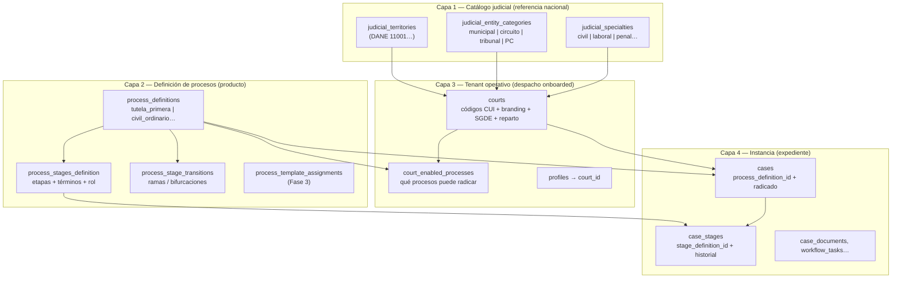

# Arquitectura de plataforma judicial — Tutelia

Mapa de destino para escalar de **un despacho piloto (051 civil circuito Bogotá)** a **miles de juzgados**, múltiples **especialidades** (civil, laboral, penal…) y **tipos de proceso** (tutela, ordinario, ejecutivo…), sin reescribir la app cada vez.

**Estado:** Fase 1 en migración `20260529120000_judicial_process_platform_phase1.sql`. **Fase 2 (runtime)** cableada: `CourtOperationalProvider`, CUI desde `courts`, equipo desde `profiles`, pipelines desde `process_definitions`.

**Alcance de producto hoy (MVP):** solo **tutelas** — `tutela_primera`, `tutela_segunda`, `consulta_desacato`. La BD ya admite más `process_definitions`; el runtime filtra en `src/lib/process-product-scope.ts` hasta habilitar civil/laboral/penal con flujo completo.

---

## 1. Problema que resolvemos

Hoy el modelo mezcla tres dimensiones distintas:

| Dimensión | Dónde vive hoy | Ejemplo |
|-----------|----------------|---------|
| **Tipo de actuación** | `cases.case_type` (CHECK enum) | `tutela_primera` |
| **Etapa del trámite** | `case_stages` + `case-workflow-stages.ts` | `ADMISION`, `FALLO` |
| **Plazos / semáforo** | `cases.deadline_at`, `case-stage-deadlines.ts`, tablero | 10 días háb. fallo; 2 días contestación |

Además, **ciudad, entidad, especialidad y despacho CUI** están en `COURT_CONSTANTS` (código global), no en `courts`.

Para civil ordinario, laboral o penal hace falta una capa intermedia: **`process_definition`** — describe etapas, términos y reglas de *cualquier* proceso; `cases` solo referencia cuál aplica.

---

## 2. Panorama en capas



### Qué NO es un proceso independiente

- **Incidente de desacato:** actuación dentro del expediente madre (`incident_desacato`). Ver `docs/incidente-desacato-modelo-expediente.md`.
- **Consulta de desacato ante la Corte:** hito del incidente, no `process_definition` separado del caso madre.

---

## 3. Modelo de datos (detalle)

### 3.1 Catálogo judicial

Solo **referencia**. No son tenants. Se poblarán por seed mínimo (Bogotá) e import TYBA/Rama a futuro.

| Tabla | Clave | Notas |
|-------|-------|-------|
| `judicial_territories` | `dane_code` | Ciudad/municipio |
| `judicial_entity_categories` | `code` | municipal, circuito, tribunal, pequenas_causas, suprema |
| `judicial_specialties` | `code` | civil, laboral, penal, familia, administrativo |

`instance_level` en categoría de entidad es **orientativo** (1ª/2ª/3ª). La instancia real del trámite va en `process_definitions.instance_level` (ej. tutela segunda = 2).

### 3.2 Definición de proceso

| Campo | Propósito |
|-------|-----------|
| `code` | Identificador estable (`tutela_primera`) |
| `process_domain` | Dominio normativo: constitucional, civil, laboral… |
| `instance_level` | 1, 2 o 3 para el trámite |
| `legacy_case_type` | Puente con `cases.case_type` durante migración |
| `case_term_days` / `case_term_type` | Plazo global del caso (tutela: 10 hábiles desde radicación → `deadline_at`) |

**Etapas** (`process_stages_definition`):

| Campo | Alineación con código actual |
|-------|------------------------------|
| `code` | = `CaseStageCode` / CHECK en `case_stages` |
| `responsible_role` | `secretaria` \| `despacho` (no judge/clerk sueltos) |
| `term_days` + `term_type` | Contestación 2 háb.; impugnación 3 háb.; remisión Corte 10 háb. |
| `stage_kind` | `linear` (carril), `branch`, `terminal`, `optional` |
| `workflow_task_type` | `generate_notifs` en ADMISION/FALLO |

**Transiciones** (`process_stage_transitions`): grafo para ramas (INADMISION, RECHAZO, IMPUGNACION). Fase 1 crea la tabla; el runtime lineal sigue en TS hasta Fase 2.

### 3.3 Despacho (`courts`)

| Campo nuevo | CUI |
|-------------|-----|
| `dane_code` | 11001 |
| `entity_code` | 31 circuito civil, 40 municipal… |
| `specialty_code` | 03 civil |
| `despacho_number` | 051 |
| FKs opcionales | `territory_id`, `entity_category_id`, `judicial_specialty_id` |

Función SQL: `court_radicacion_prefix(court_id, year)` → primeros 16 dígitos del radicado.

### 3.4 Caso

- `cases.process_definition_id` → FK a definición (coexiste con `case_type`).
- `case_stages.stage_definition_id` → FK opcional a etapa (Fase 2 cablea runtime).

### 3.5 Multi-tenant

Sin cambios: **RLS por `court_id`**. Catálogo y definiciones de proceso: lectura para `authenticated`; escritura solo `service_role` / migraciones.

---

## 4. CUI de 23 dígitos

```
11001 | 31 | 03 | 051 | 2026 | 00123 | 00
  │      │    │     │      │       │      └── instancia (00 1ª, 01 2ª)
  │      │    │     │      │       └── consecutivo (5 dígitos)
  │      │    │     │      └── año (4)
  │      │    │     └── despacho (3)
  │      │    └── especialidad (2)
  │      └── entidad (2)
  └── territorio DANE (5)
```

**Regla:** todo lo que arma o valida radicados lee de `courts`, con fallback temporal a `COURT_CONSTANTS` hasta Fase 2 en código.

---

## 5. Módulos de producto (horizonte 6–24 meses)

Los módulos no se cuelgan del juzgado individual sino de **dominio + categoría + proceso**:

| Módulo | `process_domain` | Procesos ejemplo | Estado |
|--------|------------------|------------------|--------|
| Tutela constitucional | constitucional | tutela_primera, tutela_segunda, consulta_desacato* | ✅ operativo |
| Civil circuito | civil | ordinario, ejecutivo, verbal (futuro) | 🔜 datos |
| Laboral | laboral | ordinario, ejecutivo | 🔜 |
| Penal | penal | … | 🔜 |

\* `consulta_desacato` como tipo de radicación existe; el incidente en expediente madre sigue el modelo cerrado de desacato.

`court_enabled_processes` decide qué filas de `process_definitions` puede usar cada despacho onboarded.

---

## 6. Estado actual vs destino (inventario repo)

| Componente | Archivo(s) | Hoy | Destino |
|------------|-----------|-----|---------|
| Pipeline etapas | `src/lib/case-workflow-stages.ts` | Hardcode por `case_type` | Lee `process_stages_definition` |
| UI carril | `CaseStagesExperience.tsx`, `useCaseStages.ts` | TS pipeline | Mismo + BD |
| Plazos etapa | `case-stage-deadlines.ts` | if por `stage_code` | `term_days` + `term_type` de definición |
| Semáforo tablero | `expedientes-view-model.ts` | 10 días fijos | `case_term_days` del proceso |
| Radicación | `NewCase.tsx` | CUI desde `courts` | ✅ Fase 2 |
| Selector tipo | `CaseTypeSelector.tsx` | 3 tutelas activas + tarjetas «Próximamente» deshabilitadas | Futuro: habilitar al ampliar `MVP_RADICABLE_CASE_TYPES` |
| SGDE | `sgde-tutela-metadata.ts` | CUI desde fila `courts` | ✅ Fase 2 |
| Alcance producto | `process-product-scope.ts` | Solo tutelas radicables | Ampliar al habilitar otros módulos |
| CHECK etapas | migración `case_stages` | Enum fijo SQL | Relajar + validar por FK (Fase 2) |

---

## 7. Plan de ejecución

### Fase 1 — Fundación (esta migración) ✅

- Tablas catálogo + `process_definitions` + etapas + transiciones (vacías).
- CUI en `courts`; seed Bogotá 051 en `court-1`.
- Seed exacto de las 3 tutelas desde `STAGE_PIPELINE_BY_CASE_TYPE`.
- `court_enabled_processes` para `court-1`.
- `cases.process_definition_id` backfill desde `case_type`.
- **Sin cambiar** UI ni `case-workflow-stages.ts` todavía.

### Fase 2 — Runtime process-aware (4–6 semanas)

1. `src/lib/process-definitions-service.ts` — carga con caché React Query.
2. Refactor `case-workflow-stages.ts`: BD primero, fallback hardcode.
3. Unificar semáforo: `case_term_days` + plazos por etapa.
4. Relajar CHECK `case_stages.stage_code`; poblar `stage_definition_id` al avanzar etapa.
5. Sacar `COURT_CONSTANTS` de `NewCase`, SGDE, consecutivos.

### Fase 3 — Otros tipos de proceso (cuando exista flujo, no antes)

1. Implementar módulo (plantillas, etapas, radicación) para el nuevo tipo.
2. Ampliar `MVP_RADICABLE_CASE_TYPES` en `process-product-scope.ts`.
3. Sustituir tarjetas fijas por selector desde `court_enabled_processes` (opcional).
4. Primer candidato: **civil ordinario** mínimo.

**Hasta entonces:** aunque se inserten filas `civil_ordinario` en BD, la app **no las muestra ni radica**.

### Fase 4 — Escala nacional

1. Import catálogo territorial (TYBA / listados Rama).
2. Onboarding despacho: CUI + procesos habilitados + SGDE folder.
3. Módulos laboral / penal como nuevas filas en `process_definitions`.

---

## 8. Orden de archivos a tocar (Fase 2)

```
1. src/lib/court-radicacion-config.ts          ← nuevo: CUI desde courts
2. src/lib/process-definitions-service.ts      ← nuevo: pipeline + términos BD
3. src/lib/case-workflow-stages.ts             ← delegar a servicio
4. src/lib/case-stage-deadlines.ts
5. src/lib/expedientes-view-model.ts
6. src/pages/NewCase.tsx
7. server/sgde-tutela-metadata.ts
8. src/components/new-case/CaseTypeSelector.tsx
9. src/components/expediente/CaseStagesExperience.tsx
10. supabase: relajar CHECK case_stages.stage_code
```

---

## 9. Decisiones cerradas

1. **`courts.id` sigue siendo `text`** (`court-1`). No migrar a UUID en esta línea de trabajo.
2. **Incidente de desacato** no es `process_definition` ni hijo en `cases`.
3. **`case_type` no se elimina** hasta que todo el runtime use `process_definition_id`.
4. **Roles de etapa** en BD: `secretaria` | `despacho`; mapeo a perfiles en `resolveWorkflowAssigneeId`.
5. **Catálogo completo nacional** no bloquea Fase 1–2; códigos en `courts` bastan para radicar.

---

## 10. Referencias en repo

- Core tenant: `supabase/migrations/20250428120000_tutelia_core.sql`
- Etapas: `supabase/migrations/20250512000001_tutelia_workflow_stages_precedents.sql`
- Pipeline TS: `src/lib/case-workflow-stages.ts`
- Constantes CUI: `src/constants.ts`
- Desacato: `docs/incidente-desacato-modelo-expediente.md`
- Fase 1 SQL: `supabase/migrations/20260529120000_judicial_process_platform_phase1.sql`
- **SIERJU (estadística CSJ):** `docs/sierju-estadistica-integracion.md` — catálogo formularios, movimientos, plan de conexión con expedientes y export trimestral
