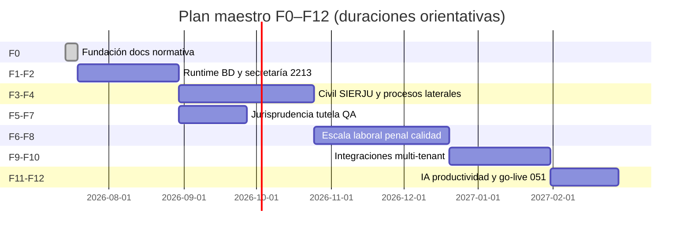

# Plan maestro — cierre de gaps operación judicial

**Objetivo:** llevar Tutelia desde el estado actual (tutela madura + civil en expansión) a operación completa de un **juzgado civil de circuito** alineada con CGP, Decreto 2591, Ley 2213, protocolo CSJ, SIERJU/TYBA y estándar secretaría J51.

**Alcance:** auditoría jul 2026 + integraciones + multi-tenant + go-live piloto 051. **13 fases (F0–F12).**  
**Piloto de referencia:** Juzgado 051 Civil del Circuito de Bogotá D.C.  
**Criterio de cierre global:** cada ítem tiene **Definition of Done (DoD)** verificable; al terminar cada fase se ejecuta checklist de revisión (§12).

**Estado base del repo (línea de partida):**

| Área | Estado |
|------|--------|
| Tutela 1ª/2ª + desacato | Operativo (MVP) |
| Civil (5 `case_type`) | Radicable; pipeline CGP parcial |
| Ley 2213 en runtime | Ausente |
| Oficios J51 en app | Genéricos (skill externo) |
| Archivo judicial | Solo etapa `EJECUTORIA` |
| SIERJU fino (26 clases) | Catálogo docs; runtime colapsado |
| Laboral / penal | Preview UI |

### Índice de fases (F0–F12)

| Fase | Nombre | Estado jul 2026 |
|------|--------|-----------------|
| **F0** | Fundación documental y normativa | **Cerrada** |
| **F1** | Runtime 100% `process_definitions` | Pendiente |
| **F2** | Secretaría, Ley 2213, oficios J51 | Pendiente |
| **F3** | Civil granular (trámite + perfil) | Pendiente |
| **F4** | Procesos laterales (comisiones, archivo…) | Pendiente |
| **F5** | Jurisprudencia en redacción | Parcial |
| **F6** | Laboral, penal, onboarding nacional | Pendiente |
| **F7** | Tutela: cierre detalles + QA | Parcial |
| **F8** | Calidad, tests, RLS, PDF protocolo | Transversal |
| **F9** | Integraciones (SGDE, TYBA, correo, reparto) | Pendiente |
| **F10** | Plataforma multi-tenant operativa | Parcial |
| **F11** | IA y productividad (política PCSJA) | Parcial |
| **F12** | Go-live piloto 051 y operación continua | Pendiente |

---

## Mapa de fases



| Fase | Nombre | Duración orientativa | Dependencias |
|------|--------|----------------------|--------------|
| **F0** | Fundación documental y normativa | 1 semana | — |
| **F1** | Runtime 100% `process_definitions` | 3–4 semanas | F0 |
| **F2** | Secretaría, Ley 2213, oficios J51 | 3–4 semanas | F1 |
| **F3** | Civil granular (trámite + perfil) | 4 semanas | F1 |
| **F4** | Procesos laterales (comisiones, competencia, archivo) | 4 semanas | F2, F3 |
| **F5** | Jurisprudencia integrada en despacho | 2 semanas | F2 |
| **F6** | Laboral, penal, escala nacional | 6+ semanas | F4 |
| **F7** | Tutela: cierre detalles (remisión, desacato, SIERJU, QA) | 2 semanas | F1 (paralelo tras F2) |
| **F8** | Calidad, tests, RLS, auditoría PDF | transversal | F1 en adelante |
| **F9** | Integraciones ecosistema judicial | 4 semanas | F2, F4 |
| **F10** | Plataforma multi-tenant operativa | 4 semanas | F6 |
| **F11** | IA y productividad secretaría/despacho | 3 semanas | F2, F5 |
| **F12** | Go-live piloto 051 y operación continua | 3 semanas | F7, F8, F9, F10, F11 |

**Paralelismo:** F3 ∥ F2 (tras F1); F5 ∥ F3; F7 ∥ F4; F8 transversal; F11 puede iniciar tras F5.

---

## F0 — Fundación documental y normativa

### F0.1 Actualizar documentación desfasada

| ID | Tarea | Archivos | DoD |
|----|-------|----------|-----|
| F0.1.1 | Actualizar alcance MVP en arquitectura: tutela + civil radicable | `docs/architecture-plataforma-judicial.md` §1, §5, §6 | Texto refleja `RADICABLE_CASE_TYPES` actual |
| F0.1.2 | Actualizar `AUDITORIA_TECNICA.md`: SGDE implementado, conteo migraciones, módulos civiles | `docs/AUDITORIA_TECNICA.md` | Sin afirmaciones falsas sobre SGDE |
| F0.1.3 | Añadir referencia cruzada a este plan | `docs/architecture-plataforma-judicial.md` §10 | Enlace al plan maestro |
| F0.1.4 | Documentar flujo real tutela 051 como baseline QA | `docs/reference/flujo_real_tutela_juzgado051.html` + `docs/qa-checklist-tutela-051.md` (nuevo) | Checklist manual reproducible |

> **Estado jul 2026:** F0 **cerrada** — architecture, AUDITORIA, normativa, matriz, regla 2213, QA checklist, art. 76 unificado.

### F0.2 Corpus normativo dentro del repo

| ID | Tarea | Archivos | DoD |
|----|-------|----------|-----|
| F0.2.1 | Copiar consolidados desde skill J51 o submodule | `docs/normativa/` (nuevo); fuente: `~/.cursor/skills/oficios-juzgado-51-civil-bogota/normativa/full_text/` | IA y desarrolladores pueden `@docs/normativa` sin skill externo |
| F0.2.2 | Resumen operativo Ley 2213 para notificaciones | `docs/ley-2213-notificaciones-resumen.md` (nuevo) | Arts. aplicables a correo, constancias, validez |
| F0.2.3 | Unificar referencia contestación CGP | `server/analyze-piece-service.ts`, `docs/piece-ai-lectura-rapida.md` | **Ago 2026:** verbal = art. **369** (20 háb.). Ni 76 (terminación del poder) ni 371. |

### F0.3 Reglas de producto explícitas

| ID | Tarea | Archivos | DoD |
|----|-------|----------|-----|
| F0.3.1 | Matriz tutela vs civil vs ejecutivo | `docs/matriz-procesos-tutela-civil.md` (nuevo) | Tabla plazos, etapas, actos, SIERJU |
| F0.3.2 | Regla Cursor actualizada con Ley 2213 | `.cursor/rules/protocolo-expediente-electronico-csj.mdc` o regla nueva `ley-2213-notificaciones.mdc` | Agentes citan 2213 en notificaciones |

---

## F1 — Runtime 100% `process_definitions`

**Problema:** pipeline híbrido TS + BD; transiciones en grafo no cableadas; ramas INADMISION/RECHAZO poco automáticas.

### F1.1 Servicio de definiciones como fuente única

| ID | Tarea | Archivos | DoD |
|----|-------|----------|-----|
| F1.1.1 | BD primero; fallback TS solo en dev/test | `src/lib/process-definitions-service.ts`, `src/lib/case-workflow-stages.ts` | Feature flag `PROCESS_RUNTIME_BD_ONLY`; log warning si usa fallback en prod |
| F1.1.2 | Añadir vitest + tests pipeline tutela/civil = BD | `package.json` script `test`, `src/lib/__tests__/process-definitions-service.test.ts` (nuevo) | CI verde |
| F1.1.3 | Poblar `stage_definition_id` en cada transición | `src/lib/case-stages-service.ts`, migración SQL | 100% etapas nuevas con FK |

### F1.2 Motor de transiciones (grafo)

| ID | Tarea | Archivos | DoD |
|----|-------|----------|-----|
| F1.2.1 | `resolveNextStages(caseId, event)` desde `process_stage_transitions` | `src/lib/process-stage-transitions.ts` (nuevo) | Soporta INADMISION, RECHAZO, IMPUGNACION, APELACION |
| F1.2.2 | Reemplazar avance lineal en `case-stages-service.ts` | `src/lib/case-stages-service.ts` | Ramas automáticas según acto registrado |
| F1.2.3 | UI: selector de rama cuando hay bifurcación | `src/components/expediente/CaseStagesExperience.tsx` | Secretaría elige rama con trazabilidad |
| F1.2.4 | Semáforo desde `case_term_days` + términos etapa BD | `src/lib/case-stage-deadlines.ts`, `src/lib/expedientes-view-model.ts` | Sin constantes duplicadas en TS |

### F1.3 Relajar enum SQL de etapas

| ID | Tarea | Archivos | DoD |
|----|-------|----------|-----|
| F1.3.1 | Verificar migración existente + backfill `stage_definition_id` | `supabase/migrations/20260530120000_relax_case_stages_stage_code_check.sql` (ya aplicada) | 100% inserciones nuevas con FK; nuevas etapas sin migración SQL adicional |
| F1.3.2 | Completar seed transiciones faltantes (nueva migración si aplica) | nueva migración tras auditar `process_stage_transitions` | Grafo documentado en comentario SQL; 0 transiciones huérfanas |

### F1.4 Eliminar `COURT_CONSTANTS` residual

| ID | Tarea | Archivos | DoD |
|----|-------|----------|-----|
| F1.4.1 | Auditoría grep `COURT_CONSTANTS` | todo `src/`, `server/` | 0 usos en rutas de radicación/SGDE |
| F1.4.2 | CUI y branding solo desde `courts` | `src/pages/NewCase.tsx`, `server/sgde-*.ts` | Multi-tenant listo |

**DoD fase F1:** ningún flujo de etapas depende de `STAGE_PIPELINE_BY_CASE_TYPE` en producción; transiciones INADMISION/RECHAZO funcionan en tutela y civil.

---

## F2 — Secretaría, Ley 2213 y oficios J51

### F2.1 Ley 2213 en notificaciones electrónicas

| ID | Tarea | Archivos | DoD |
|----|-------|----------|-----|
| F2.1.1 | Modelo `notification_records` | migración SQL: `court_id`, `case_id`, `channel`, `recipients`, `sent_at`, `constancia_pdf_path`, `law_2213_basis` | RLS por court |
| F2.1.2 | Constancia de notificación PDF en expediente | `src/lib/notificacion-secretaria-flow.ts`, `src/lib/generate-judicial-pdf.ts` | PDF `ConstanciaNotificacionAAAAMMDD.pdf` protocolo CSJ |
| F2.1.3 | Validación destinatarios (correo institucional, múltiples) | `notificacion-secretaria-flow.ts` | Error claro si formato inválido |
| F2.1.4 | Reglas: notificación surte desde envío / recepción según 2213 | `src/lib/ley-2213-notificacion-rules.ts` (nuevo) | Tests con escenarios tutela y civil |
| F2.1.5 | Panel historial notificaciones por expediente | `CaseNotificacionesPanel.tsx` | Lista con reenvío y constancia |

### F2.2 Oficios con estándar J51

| ID | Tarea | Archivos | DoD |
|----|-------|----------|-----|
| F2.2.1 | Consecutivo oficios por despacho y año | tabla `court_office_sequences`; RPC `next_oficio_number(court_id)` | Formato `OFICIO No. NN – YYY` |
| F2.2.2 | Plantillas con encabezado fijo J51 | `document_templates`, seed migración | 4 tipos + bloques obligatorios del skill |
| F2.2.3 | Reemplazar cuerpos genéricos JSON | `src/data/catalogos/tipos-oficio-secretaria.json` | Alineado con skill `oficios-juzgado-51-civil-bogota` |
| F2.2.4 | Párrafo fundamento normativo (CGP / 2213 / CC) | `src/lib/plantilla-variables.ts`, prompt IA opcional | Campo `fundamento` autocompletado desde auto |
| F2.2.5 | Registro oficios salientes en expediente | `case_documents` + acto `oficio_saliente` | PDF nombrado `OficioJuzgado.pdf`, `OficioComision.pdf`, etc. |
| F2.2.6 | UI: fecha en letras (patrón J51) | `plantilla-variables.ts` | `Bogotá, D.C. siete (07) de abril de dos mil veintiséis (2026)` |

### F2.3 Términos procesales avanzados (CGP)

| ID | Tarea | Archivos | DoD |
|----|-------|----------|-----|
| F2.3.1 | Suspensión de términos | tabla `case_term_suspensions`; UI en etapa | Motivo, fechas, artículo CGP |
| F2.3.2 | Interrupción de términos | `case_term_interruptions` o campo en suspensions | Recalculo `stage_deadline_at` |
| F2.3.3 | Reemplazar solo `deadline_override_note` manual | `cases`, `case_stages.metadata` | Auditoría en `case_actions` |

### F2.4 Secretaría — informe y radicación

| ID | Tarea | Archivos | DoD |
|----|-------|----------|-----|
| F2.4.1 | Informe ingreso siempre `InformeIngresoDespacho.pdf` | ya parcial; verificar todos los canales | SGDE, correo, manual |
| F2.4.2 | Reparto sustanciador configurable por court | `sustanciador-reparto.ts`, columnas `courts.sustanciador_*` (migración 20250429320000) | UI Settings expone modo asignación |
| F2.4.3 | Tareas workflow alineadas con etapa BD | `workflow_tasks`, `workflow-stage-notifications.ts` | Sin tareas huérfanas |

**DoD fase F2:** cada notificación genera constancia 2213; cada oficio tiene número consecutivo y formato J51; suspensiones recalculan plazos.

---

## F3 — Civil granular (trámite + perfil + etapa)

**Problema:** 26+ clases SIERJU colapsadas en 5 `case_type`. `civil_ordinario` es un solo tubo; el cubo `TRAMITE` esconde 370 / 372 / 373 y la inspección del 375. F3 **no** se resuelve inventando `civil_verbal` / `civil_pertenencia` como tubos paralelos.

**Modelo (tres capas):**

1. **Trámite** — qué capítulo del CGP rige (`verbal`, `ejecutivo`, `divisorio`, …).
2. **Perfil** — norma especial que se suma (`ninguno`, `375`, `376`, `406`, hipotecario). Pertenencia no es proceso aparte.
3. **Etapa** — eje de secretaría; se infiere por piezas (admisorio, contestación, descorre 370, acta 375 num. 9). Override humano.

SIERJU sigue siendo etiqueta estadística. Cautelares, incidentes y recursos son hilos paralelos (F4), no la siguiente casilla del carril.

Fuente canónica **nacional** (civil circuito): `docs/cgp/tramites-cgp.json`. El 051 es el primer tenant. **No** activar BD-only hasta que el seed coincida con ese JSON y con `civil-business-days.ts`.

### F3.1 SIERJU como estadística (no manda el carril)

| ID | Tarea | Archivos | DoD |
|----|-------|----------|-----|
| F3.1.1 | Pedir `cases.sierju_process_class_id` al radicar civil | `NewCase.tsx`, `sierju-catalog-service.ts` | Clase SIERJU en cada civil; el pipeline sale del trámite+perfil, no de la etiqueta |
| F3.1.2 | Mapa SIERJU → trámite + perfil (no un `process_definition` por clase) | `docs/sierju/mapeo-tyba-sgde-clases.md` + `tramites-cgp.json` | Pertenencia / servidumbre / RC → `civil_ordinario` + perfil 375/376/ninguno |
| F3.1.3 | UI selector clase al radicar | `NewCase.tsx`, `CaseTypeSelector.tsx` | Filtra por `case_type` padre; muestra perfil CGP inferido |

### F3.2 Overlays sobre los cinco tubos (sin nuevos `case_type`)

| ID | Tarea | Prioridad | DoD |
|----|-------|-----------|-----|
| F3.2.1 | Cargar `tramites-cgp.json` a actos + gates en runtime TS | Alta | **Parcial ago 2026:** overlay + gate 375 (nacional, civil circuito). Falta substages BD y BD-only |
| F3.2.2 | Desglosar cubo `TRAMITE` (370, 372, 373) en actos gatillo | Alta | Secretaría ve qué pieza cierra cada tramo; no forzar `FALLO` si falta 372/373 |
| F3.2.3 | Gate pertenencia 375 num. 9 | Alta | No abrir sentencia sin `acta_inspeccion_judicial` |
| F3.2.4 | Verbal sumario / monitorio | Media | Nuevas filas en el JSON, overlay sobre tubo existente |
| F3.2.5 | Hipotecario | Media | Perfil sobre `civil_ejecutivo`, no `civil_ejecutivo_hipotecario` |
| F3.2.6 | `civil_otros` | Baja | Comodín solo si no hay trámite en el JSON |

### F3.3 Actos y plantillas por trámite/perfil

| ID | Tarea | Archivos | DoD |
|----|-------|----------|-----|
| F3.3.1 | Extender `case-act-types.ts` (descorre 370, acta 375-9, etc.) | `case-act-types.ts`, migración act types | Gates de F3.2.2–F3.2.3 |
| F3.3.2 | Plantillas despacho: mandamiento, auto verbal, pertenencia | `document_templates` seeds | Una plantilla mínima por trámite/perfil frecuente |
| F3.3.3 | Checklist contestación / excepciones | `case-contestacion-checklist.ts` | Arts. 369 y 442; no 76 ni 443 |

### F3.4 Estadística SIERJU

| ID | Tarea | Archivos | DoD |
|----|-------|----------|-----|
| F3.4.1 | Export trimestral desde `sierju_process_class_id` | `src/lib/sierju-export.ts` (nuevo) | CSV validado contra formulario CSJ |
| F3.4.2 | Dashboard segmentado por clase | `Estadisticas.tsx`, `tutela-stats-dashboard.ts` | Filtro civil por clase |

**DoD fase F3:** cada civil tiene trámite+perfil (JSON nacional civil circuito) y clase SIERJU para estadística; pertenencia/divisorio no son `case_type` nuevos; cubo `TRAMITE` tiene actos gatillo; export SIERJU coherente. Un despacho nuevo no exige un tubo nuevo.

---

## F4 — Procesos laterales

### F4.1 Comisiones y auxiliares de justicia

| ID | Tarea | Archivos | DoD |
|----|-------|----------|-----|
| F4.1.1 | Entidad `case_commissions` | migración: comisionado, plazo, auto_origen, estado | RLS court |
| F4.1.2 | Flujo: oficio comisión → seguimiento → resultado | UI nueva pestaña o panel en expediente | PDF resultado en expediente |
| F4.1.3 | Alertas vencimiento comisión | `workflow_tasks` tipo `comision_vencida` | Semáforo en dashboard |
| F4.1.4 | Crear comisión al enviar oficio comisión | panel comisiones (F4.1.2), no mezclar con notificaciones | Registro `case_commissions` vinculado al oficio PDF |

### F4.2 Competencia y reparto inter-despacho

| ID | Tarea | Archivos | DoD |
|----|-------|----------|-----|
| F4.2.1 | Actuación `rechazo_competencia` | `case-act-types.ts`, transición a cierre | Oficio competencia + constancia |
| F4.2.2 | Registro remisión a otro despacho | `case_remisiones`: destino CUI, fecha, medio | Trazabilidad TYBA manual inicial |
| F4.2.3 | Estado caso `remitido_competencia` | `types.ts` CaseStatus | No cuenta en semáforo activo |
| F4.2.4 | Plantilla devolución sin radicar | flujo NewCase inverso | Documentación en expediente origen |

### F4.3 Archivo judicial y post-ejecutoria

| ID | Tarea | Archivos | DoD |
|----|-------|----------|-----|
| F4.3.1 | Subflujo archivo tras `EJECUTORIA` | etapas `INDICE_CERRADO`, `ARCHIVO_GESTION`, `ARCHIVO_CENTRAL` | Opcional por court |
| F4.3.2 | Generación `00IndiceElectronicoC01.pdf` | `src/lib/expediente-indice.ts` (nuevo) | Protocolo CSJ §7.3 |
| F4.3.3 | Cuaderno `04Ejecucion` | `expediente-notebook.ts` | Procesos con sentencia ejecutoriada |
| F4.3.4 | PDF/A para piezas de archivo largo plazo | `generate-judicial-pdf.ts` o post-proceso | Flag `archival_pdf_a` en metadata |
| F4.3.5 | Bloqueo edición expediente archivado | RLS + UI read-only | Solo consulta |

### F4.4 Ejecución de sentencias

| ID | Tarea | Archivos | DoD |
|----|-------|----------|-----|
| F4.4.1 | Apertura cuaderno ejecución desde sentencia | wizard en `CaseDetail` | No nuevo `cases`; mismo CUI |
| F4.4.2 | Actos ejecución: liquidación, remate, entrega | `case-act-types.ts` civil ejecución | Pipeline parcial post-sentencia |
| F4.4.3 | Plazos CGP ejecución | `civil-business-days.ts` | Arts. pertinentes documentados |

### F4.5 Audiencias orales

| ID | Tarea | Archivos | DoD |
|----|-------|----------|-----|
| F4.5.1 | Entidad `case_hearings` | migración: fecha, sala, tipo, estado | Baseline existente: acto `acta_audiencia` → `ActaAudiencia.pdf` en `case-act-types.ts` |
| F4.5.2 | Citación y acta audiencia | actos + plantilla | PDF `ActaAudienciaAAAAMMDD.pdf` |
| F4.5.3 | Integración etapa `TRAMITE` | `CaseStagesExperience.tsx` | Audiencia programada → acta → continuar trámite |

**DoD fase F4:** comisión trazable de inicio a fin; rechazo competencia con remisión registrada; índice electrónico generable; cuaderno ejecución operativo.

---

## F5 — Jurisprudencia integrada en despacho

> **Baseline jul 2026:** `DespachoPrecedentsAssist` en `CaseDespachoDocumentosPanel.tsx`, búsqueda en `CaseSintesisPanel.tsx`, `precedents.legal_specialty` en BD. F5 cierra gaps restantes (tags, filtro fino, indexación SIERJU).

| ID | Tarea | Archivos | DoD |
|----|-------|----------|-----|
| F5.1 | Clasificación precedentes por materia | `precedents.specialty`, UI badge | tutela / civil / familia / ejecutivo |
| F5.2 | Búsqueda precedentes en panel despacho al redactar fallo | `CaseSintesisPanel.tsx`, `CaseDespachoDocumentosPanel.tsx` | Sugerencias antes de firmar |
| F5.3 | Indexación automática con `decision_type` SIERJU | `precedents-index-client.ts`, `sierju-tutela-informe.ts` | Metadata completa |
| F5.4 | Líneas jurisprudenciales (tags) | `precedent_tags` tabla | Filtro en biblioteca |
| F5.5 | No confundir precedente con regla de plazo | documentación | Precedentes no alteran `deadline_at` automático |

**DoD fase F5:** al redactar sentencia/fallo, el despacho ve precedentes relevantes de su materia sin salir del expediente.

---

## F6 — Laboral, penal y escala nacional

### F6.1 Nuevos dominios procesales

| ID | Tarea | Archivos | DoD |
|----|-------|----------|-----|
| F6.1.1 | `process_definitions` laboral ordinario/ejecutivo | migraciones seed | `process_domain = laboral` |
| F6.1.2 | Pipelines laboral (plazos código laboral / CGP supletorio) | `case-workflow-stages.ts` o BD | Documentado en `docs/matriz-procesos` |
| F6.1.3 | Penal conocimiento (mínimo) | idem | Preview → radicable |
| F6.1.4 | Quitar `COMING_SOON` al completar flujo | `process-product-scope.ts`, `CaseTypeSelector.tsx` | Tarjeta activa |

### F6.2 Onboarding nacional

| ID | Tarea | Archivos | DoD |
|----|-------|----------|-----|
| F6.2.1 | Import territorios TYBA | seed `judicial_territories` | >100 municipios |
| F6.2.2 | Wizard onboarding court | UI admin | CUI + procesos + SGDE + buzón |
| F6.2.3 | Extender branding por court (logo, encabezado oficios) | `court-branding.ts` (ya operativo) | Oficios J51 usan branding dinámico por `court_id` |
| F6.2.4 | `court_enabled_processes` self-service | Settings admin | Sin migración manual |

**DoD fase F6:** segundo despacho onboarded sin cambiar código; al menos un proceso laboral radicable.

---

## F7 — Tutela: cierre de detalles pendientes

| ID | Tarea | Archivos | DoD |
|----|-------|----------|-----|
| F7.1 | Verificar remisión 2 háb. post-impugnación (art. 32 inc. 1) | `decreto-2591-plazos.ts` (`PLAZO_REMISION_EXPEDIENTE_IMPUGNACION_DIAS=2`), `applyStageTransitionImpugnacionRecibida`, `CaseStagesExperience.tsx` | En piloto 051: impugnación → `REMISION_SUPERIOR` con plazo 2 hábiles + tarea workflow; documentar en `docs/qa-checklist-tutela-051.md` |
| F7.2 | Informes autoridad 1–3 días (art. 19) | configurable en auto | Metadata plazo informe |
| F7.3 | Consulta desacato Corte — cierre flujo consulta/remisión | `CaseIncidenteDesacatoPanel.tsx` | Modelo base OK (`incident_desacato` sin caso hijo); cerrar estados consulta + remisión Corte |
| F7.4 | SIERJU tutela salida al fallar | `sierju-tutela-informe.ts` | Movimiento correcto en export |
| F7.5 | QA flujo real 051 | `docs/qa-checklist-tutela-051.md` | 100% ítems PASS en piloto |

---

## F8 — Calidad, seguridad y observabilidad

| ID | Tarea | Archivos | DoD |
|----|-------|----------|-----|
| F8.1 | Configurar vitest + tests plazos tutela + civil + 2213 | `package.json`, `src/lib/__tests__/` | Script `npm run test`; cobertura crítica en libs de plazo |
| F8.2 | Tests integración `case-stages-service` | vitest + supabase local | Transiciones principales |
| F8.3 | Auditoría humanizada completa | `audit-log-humanize.ts` | Toda acción sensible registrada |
| F8.4 | RLS nuevas tablas | cada migración F2–F4 | Políticas por `court_id` |
| F8.5 | No secretos en repo | `.env` gitignore verificado | ATT04292.env fuera de commits |
| F8.6 | Auditoría grep nombres PDF vs protocolo CSJ | `src/lib/case-act-types.ts`, `src/lib/notificacion-secretaria-flow.ts`, `src/lib/document-templates.ts` | 0 nombres con espacios/guiones; constancias con sufijo `AAAAMMDD` donde aplique |

**DoD fase F8:** `npm run test` en CI; RLS en tablas nuevas; auditoría PDF sin incumplimientos protocolo CSJ.

---

## F9 — Integraciones ecosistema judicial

**Problema:** Tutelia opera en islas (correo parcial, SGDE sync, TYBA manual). Falta trazabilidad extremo a extremo con sistemas Rama.

### F9.1 SGDE / expediente electrónico Rama

| ID | Tarea | Archivos | DoD |
|----|-------|----------|-----|
| F9.1.1 | Sync bidireccional metadatos (estado, actuaciones) | `server/sgde-sync-documents.ts`, `sgde-routes.ts` | Cambios Tutelia → SGDE documentados |
| F9.1.2 | Mapeo clases TYBA ↔ `sierju_process_class_id` | `docs/sierju/mapeo-tyba-sgde-clases.md` → TS | Import SGDE asigna clase automática |
| F9.1.3 | `case.sgde_id` visible en UI (no texto fijo) | `CaseDetail.tsx` | Muestra ID real o enlace portal |
| F9.1.4 | Reparación storage huérfanos SGDE | `server/sgde-repair-storage.ts` | Job documentado + botón admin |
| F9.1.5 | Crear expediente SGDE desde radicación Tutelia | `server/sgde-create-expediente.ts` | Opcional por court; trazabilidad |

### F9.2 Módulo correo (Outlook / Graph)

| ID | Tarea | Archivos | DoD |
|----|-------|----------|-----|
| F9.2.1 | Filtros bandeja (remitente, fecha, leído) | `Correo.tsx`, `outlook-routes.ts` | P3 roadmap cerrado |
| F9.2.2 | Polling / badge nuevos correos | `Correo.tsx`, React Query | Sin refresh manual obligatorio |
| F9.2.3 | Firma institucional en envíos desde Tutelia | `notificacion-secretaria-flow.ts`, plantillas | HTML firma J51 |
| F9.2.4 | Ingest automático correo reparto → borrador caso | `ingest-outlook-to-case.ts` | Regla + confirmación secretaría |
| F9.2.5 | Documentar límites explícitos (no hilo Graph) | `docs/correo-roadmap.md` | Sin expectativa respuesta en hilo |

### F9.3 Reparto y competencia externa

| ID | Tarea | Archivos | DoD |
|----|-------|----------|-----|
| F9.3.1 | Registro acta reparto PDF automático | `pdf-acta-detect.ts`, `NewCase.tsx` | Metadatos acta en `case_actions` |
| F9.3.2 | API reparto Rama (cuando exista) — adaptador | `server/reparto-rama-adapter.ts` (nuevo) | Feature flag; fallback manual |
| F9.3.3 | Export paquete remisión competencia (ZIP PDF) | F4.2 + nuevo lib | CUI origen/destino en manifest |

### F9.4 TYBA / estadística

| ID | Tarea | Archivos | DoD |
|----|-------|----------|-----|
| F9.4.1 | Pipeline export SIERJU trimestral producción | F3.4.1 + cron/job | Archivo listo para cargue CSJ |
| F9.4.2 | Validación cobertura vs `SIERJU_TUTELAS_COBERTURA` | `Estadisticas.tsx` | Gaps documentados o cerrados |
| F9.4.3 | Inventario inicial/final expediente | migración campos `cases` | Campos SIERJU inventario |

**DoD fase F9:** SGDE ID real en UI; correo P3 operativo; export SIERJU reproducible; TYBA mapeado en import.

---

## F10 — Plataforma multi-tenant operativa

**Baseline:** `docs/arquitectura/MULTI_TENANT_EVOLUTION.md` — Fase A–F parcial en migraciones 20260613–20260614.

### F10.1 Membresía y RLS

| ID | Tarea | Archivos | DoD |
|----|-------|----------|-----|
| F10.1.1 | RLS 100% vía `auth_user_has_court` / `current_court_id()` | migración macro RLS | 0 tablas solo `profiles.court_id` |
| F10.1.2 | UI cambio despacho activo (M:N) | `profile_court_memberships`, Shell | Funcionario multi-despacho |
| F10.1.3 | Deprecar `profiles.is_superuser` | migración + seeds | Solo `platform_admins` |
| F10.1.4 | `viewAs` court para platform admin | `PlatformCourtSelectionPrompt.tsx` | Auditoría en `platform_audit_log` |

### F10.2 Consola plataforma

| ID | Tarea | Archivos | DoD |
|----|-------|----------|-----|
| F10.2.1 | Onboarding wizard F6.2.2 integrado en `/plataforma` | `server/platform-routes.ts` | CUI + procesos + buzón en un flujo |
| F10.2.2 | KPIs por court (activos, vencidos, SGDE) | consola plataforma | Dashboard regional |
| F10.2.3 | Suspender / reactivar court | `courts.status` | RLS bloquea escritura si suspended |
| F10.2.4 | Admins regionales (Fase F MULTI_TENANT) | migración `platform_regional_admins` | Scope territorial |

### F10.3 Bulk y catálogo nacional

| ID | Tarea | Archivos | DoD |
|----|-------|----------|-----|
| F10.3.1 | Bulk import producción (>500 courts) | `bulk_upsert_courts`, job async | Cola + reporte errores |
| F10.3.2 | Seed territorios TYBA completo | `judicial_territories` | F6.2.1 cerrado |
| F10.3.3 | Habilitar procesos por court self-service | `court_enabled_processes` UI | Sin SQL manual |

### F10.4 Storage y housekeeping

| ID | Tarea | Archivos | DoD |
|----|-------|----------|-----|
| F10.4.1 | Edge function / job borrar Storage huérfanos | comentarios migración storage | Documentado en runbook |
| F10.4.2 | Límites tamaño por court (cuota) | metadata `courts` | Alerta 80% uso |
| F10.4.3 | Backup export expediente (ZIP protocolo) | nuevo endpoint | Descarga CUI completo |

**DoD fase F10:** segundo despacho onboarded solo desde consola; RLS membresía M:N; platform admin sin `is_superuser`.

---

## F11 — IA y productividad (dentro de política PCSJA)

**Límite cerrado:** ver `docs/ai-despacho-asistencia.md` — **no** generar fallos/sentencias con IA.

### F11.1 Secretaría asistida

| ID | Tarea | Archivos | DoD |
|----|-------|----------|-----|
| F11.1.1 | Lectura rápida pieza en todos los tipos proceso | `analyze-piece-service.ts` | tutela + civil + futuro laboral |
| F11.1.2 | Borrador informe secretaría desde auto (CGP) | salida `cgp_auto_v2` | Campo copiable a informe |
| F11.1.3 | Clasificación automática correo judicial | `outlook-classify-message.ts` | Etiqueta proceso/urgencia |
| F11.1.4 | Checklist contestación sugerido por IA | `case-contestacion-checklist.ts` | Solo sugerencia; no auto-cierre |

### F11.2 Despacho asistido

| ID | Tarea | Archivos | DoD |
|----|-------|----------|-----|
| F11.2.1 | Precedentes en panel Word/PDF (F5.2) | `CaseDespachoDocumentosPanel.tsx` | Integrado al flujo firma |
| F11.2.2 | Revisión ortográfica borradores | `ai-review-text-service.ts` | Informe, auto, oficio |
| F11.2.3 | Síntesis expediente actualizada al fallar | `summarize-case-service.ts` | Incluye etapas y plazos |
| F11.2.4 | **Prohibido:** gate en CI que bloquee prompts de fallo | script lint prompts | 0 rutas `generate-fallo` |

### F11.3 Tableros predictivos

| ID | Tarea | Archivos | DoD |
|----|-------|----------|-----|
| F11.3.1 | Semáforo predictivo (vencimientos 48h) | `Dashboard.tsx`, `expedientes-view-model.ts` | Filtro crítico |
| F11.3.2 | Carga trabajo por sustanciador | dashboard equipo | Reparto visible |
| F11.3.3 | Alertas workflow consolidadas | `AssignmentNotificationBell` + etapas | Una bandeja tareas |

### F11.4 Ciclo Word review

| ID | Tarea | Archivos | DoD |
|----|-------|----------|-----|
| F11.4.1 | Word review → PDF firmado sin fricción | `CaseWordReviewPanel.tsx` | 4 estados cubiertos |
| F11.4.2 | Markup juez en TipTap/Word sincronizado | `case_word_reviews.review_markup_json` | Trazabilidad |
| F11.4.3 | Notificación juez al subir borrador | `word-review-notifications.ts` | Push in-app |

**DoD fase F11:** productividad medible (tiempo informe/notificación); cero generación IA de fallos.

---

## F12 — Go-live piloto 051 y operación continua

**Meta:** Juzgado 051 opera **100% tutela** y **civil ordinario/ejecutivo frecuente** en Tutelia con respaldo operativo.

### F12.1 Pre-go-live (readiness)

| ID | Tarea | Archivos | DoD |
|----|-------|----------|-----|
| F12.1.1 | Ejecutar `docs/qa-checklist-tutela-051.md` completo | QA manual | 100% PASS ítems aplicables |
| F12.1.2 | Checklist civil 051 (nuevo) | `docs/qa-checklist-civil-051.md` | Radicación → sentencia simulada |
| F12.1.3 | Runbook secretaría | `docs/runbooks/secretaria-j51.md` (nuevo) | Procedimientos día a día |
| F12.1.4 | Runbook soporte técnico | `docs/runbooks/soporte-tutelia.md` (nuevo) | Escalación, SGDE, Outlook |
| F12.1.5 | Capacitación 4h secretaría + 2h despacho | slides internos | Acta capacitación firmada |

### F12.2 Go-live

| ID | Tarea | Archivos | DoD |
|----|-------|----------|-----|
| F12.2.1 | Ventana go-live acordada con 051 | acta despacho | Fecha fija |
| F12.2.2 | Migración expedientes abiertos (si aplica) | scripts import | Inventario pre/post |
| F12.2.3 | Buzón Outlook institucional producción | `court_mailboxes` | Secretaría valida envío/recibo |
| F12.2.4 | Credenciales SGDE producción por funcionario | Settings | Al menos 2 usuarios conectados |
| F12.2.5 | Feature flags: desactivar modo demo/local | env prod | Sin `localModeWithoutSupabase` |

### F12.3 Operación continua (primeros 90 días)

| ID | Tarea | Archivos | DoD |
|----|-------|----------|-----|
| F12.3.1 | Reunión semanal feedback secretaría (4 semanas) | actas | Issues → backlog |
| F12.3.2 | Monitoreo errores (Sentry o logs estructurados) | `server.ts` | Alertas críticas < 1h |
| F12.3.3 | Primer export SIERJU trimestre real | F9.4.1 | Archivo enviado CSJ |
| F12.3.4 | Revisión plazos tutela (0 vencidos sin causa) | dashboard | Métrica mensual |
| F12.3.5 | Retrospectiva F0–F12 | actualizar §12.3 matriz | Gaps cerrados o justificados |

### F12.4 Criterios de éxito global (F12)

| Métrica | Objetivo piloto 051 |
|---------|---------------------|
| Tutelas nuevas radicadas en Tutelia | ≥ 95% |
| Notificaciones con constancia PDF + correo | 100% |
| Plazos D. 2591 con semáforo correcto | 100% verificado QA |
| Civil con clase SIERJU | 100% (post F3) |
| Tiempo medio informe ingreso | < 15 min desde correo reparto |
| Satisfacción secretaría (encuesta 1–5) | ≥ 4.0 a los 90 días |
| Segundo despacho onboarded sin código | Sí (post F10) |

### F12.5 Post-go-live (mantenimiento)

| ID | Tarea | Periodicidad |
|----|-------|--------------|
| F12.5.1 | Actualizar normativa consolidada desde Senado | Semestral |
| F12.5.2 | Re-ejecutar motor revisión §12 | Trimestral |
| F12.5.3 | Auditoría RLS y secretos | Trimestral |
| F12.5.4 | Revisión prompts IA (PCSJA) | Trimestral |
| F12.5.5 | Actualizar plan maestro / cerrar fases | Continuo |

**DoD fase F12:** piloto 051 en producción 90 días; runbooks; SIERJU real; retrospectiva con ≥ 80% gaps auditoría cerrados.

---

## §12 — Motor de revisión (checklist post-fase)

Ejecutar al cerrar **cada fase** y al final del plan:

### 12.1 Revisión de código (automática / agente)

```bash
npm run build
npm run test          # cuando existan tests F8
npm run lint          # si configurado
```

### 12.2 Revisión de alineación operativa (manual + agente explore)

| # | Pregunta | Evidencia esperada |
|---|----------|------------------|
| R1 | ¿Documentación contradice el código? | grep `solo tutelas` vs `RADICABLE_CASE_TYPES` |
| R2 | ¿Pipeline sale de BD en prod? | no fallback TS sin warning |
| R3 | ¿Tutela y civil tienen plazos distintos? | `case-stage-deadlines.ts` + tests |
| R4 | ¿Ley 2213 en notificaciones? | `notification_records` + constancia PDF |
| R5 | ¿Oficios numerados estilo J51? | `court_office_sequences` |
| R6 | ¿SIERJU clase en cada civil? | `cases.sierju_process_class_id` NOT NULL |
| R7 | ¿Desacato no crea caso hijo? | sin `cases` nuevo en incidente |
| R8 | ¿Nombres PDF protocolo CSJ? | `InformeIngresoDespacho.pdf`, TitleCase, F8.6 grep |
| R9 | ¿Archivo genera índice? | `00IndiceElectronicoC01.pdf` |
| R10 | ¿UI civil cita 369 / 442 / 322 (no 76 / 318-apelación / 443-excepciones)? | etiquetas etapa + `civil-business-days.ts` |

### 12.3 Matriz de cierre (22 gaps auditoría · 23 filas de seguimiento)

| Gap auditoría jul-2026 | Fase | ID tarea | Estado |
|------------------------|------|----------|--------|
| Docs architecture desactualizados | F0 | F0.1.1, F0.1.3 | **Cerrado** (jul 2026) |
| AUDITORIA_TECNICA desactualizada | F0 | F0.1.2 | **Cerrado** (jul 2026) |
| CGP/2213 fuera del repo | F0 | F0.2.* | **Cerrado** (normativa + resumen 2213) |
| art. 76 vs 371 IA | F0 | F0.2.3 | **Corregido ago 2026** (verbal = art. 369; 76 y 371 eran citas erróneas) |
| QA checklist tutela 051 | F0 | F0.1.4, F7.5 | **Cerrado** (doc creado; ejecución QA pendiente) |
| Matriz tutela/civil | F0 | F0.3.1 | **Cerrado** (jul 2026) |
| Regla Cursor Ley 2213 | F0 | F0.3.2 | **Cerrado** (jul 2026) |
| Pipeline híbrido TS/BD | F1 | F1.1–F1.3 | **Parcial** (transiciones BD + flag BD_ONLY) |
| Transiciones grafo no cableadas | F1 | F1.2.* | **Parcial** (motor + UI ramas; no todo el runtime) |
| COURT_CONSTANTS residual | F1 | F1.4.* | **Parcial** (UI sin INSTANCE_CODE; fallback servidor/demo) |
| Ley 2213 ausente | F2 | F2.1.* | Pendiente |
| Oficios genéricos | F2 | F2.2.* | Pendiente |
| Sin numeración oficios | F2 | F2.2.1 | Pendiente |
| Términos suspendidos CGP | F2 | F2.3.* | Pendiente |
| SIERJU colapsado | F3 | F3.1–F3.4 | Pendiente |
| Verbal/abreviado como `case_type` | F3 | F3.2.* | **Replanteado ago 2026:** overlay trámite+perfil nacional (`docs/cgp/tramites-cgp.json`); 051 = tenant |
| Comisiones incompletas | F4 | F4.1.* | Pendiente |
| Competencia sin trazabilidad | F4 | F4.2.* | Pendiente |
| Archivo judicial | F4 | F4.3.* | Pendiente |
| Ejecución sentencias | F4 | F4.4.* | Pendiente |
| Audiencias | F4 | F4.5.* | Pendiente |
| Jurisprudencia no en redacción | F5 | F5.* | **Parcial** (baseline despacho) |
| Laboral/penal preview | F6 | F6.* | Pendiente |
| art. 32 inc.1 remisión 2d | F7 | F7.1 | **Parcial** (código existe; falta QA) |
| Incidente desacato (modelo + consulta Corte) | F7 | F7.3, R7 | **Parcial** (modelo OK) |
| Protocolo CSJ nombres PDF | F2/F4/F8 | F2.1.2, F2.2.5, F4.3.2, F8.6 | Pendiente |
| SGDE UI texto fijo / sync incompleto | F9 | F9.1.* | Pendiente |
| Correo sin filtros/firma institucional | F9 | F9.2.* | Pendiente |
| TYBA / inventario SIERJU | F9 | F9.4.* | Pendiente |
| RLS membresía M:N incompleta | F10 | F10.1.* | **Parcial** |
| Consola plataforma sin wizard | F10 | F10.2.* | **Parcial** |
| IA sin política en CI | F11 | F11.2.4 | Pendiente |
| Go-live sin runbooks | F12 | F12.1.* | Pendiente |
| Operación 90 días sin métricas | F12 | F12.3–F12.4 | Pendiente |

**Estado global:** F0 cerrada · F5/F7/F10 parciales · F1–F4, F6, F8–F12 pendientes — **plan F0–F12 completo**.

### 12.4 Historial motor de revisión

| Fecha | Resultado build | Veredicto plan |
|-------|-----------------|----------------|
| jul 2026 (1ª pasada) | Éxito | **No** — correcciones aplicadas |
| jul 2026 (2ª pasada) | Éxito | **Sí** — plan listo F0–F8 |
| jul 2026 (F0 ejecutada) | Éxito | F0 **cerrada** |
| jul 2026 (F1 ejecutada) | Éxito lint+test | F1 **parcial** — motor transiciones, vitest, BD cache |

---

## Orden de implementación — sprints (2 semanas)

| Sprint | Fase | Entregable principal |
|--------|------|----------------------|
| **S1** | F0 | Docs, normativa, matriz, reglas — **hecho** |
| **S2–S3** | F1 | Runtime BD, transiciones, sin `COURT_CONSTANTS` |
| **S4–S5** | F2 | Ley 2213, oficios J51, términos CGP |
| **S6–S7** | F3 | SIERJU fino, verbal, abreviado, export |
| **S8–S9** | F4 | Comisiones, competencia, archivo, audiencias |
| **S10** | F5 + F7 | Precedentes + QA tutela 051 |
| **S11–S12** | F6 | Laboral/penal + onboarding nacional |
| **S13** | F8 | Vitest, RLS audit, PDF protocolo |
| **S14–S15** | F9 | SGDE bidireccional, correo P3, SIERJU prod |
| **S16–S17** | F10 | Multi-tenant, consola, bulk courts |
| **S18** | F11 | IA productividad + tableros |
| **S19–S20** | F12 | Go-live 051, runbooks, 90 días operación |

**Duración total orientativa:** ~40 semanas (10 meses) con paralelismo F3/F5/F7.

### Dependencias críticas (no saltar)

```
F0 → F1 → F2 ─┬→ F4 → F6 → F10 → F12
              ├→ F3 ──┘
              └→ F5 → F11 ─────────────→ F12
F1 ────────────────────→ F8 (transversal)
F2, F4 ────────────────→ F9 ──────────→ F12
```

---

## Riesgos y mitigaciones

| Riesgo | Mitigación |
|--------|------------|
| Divergencia BD ↔ TS durante F1 | Feature flag `PROCESS_RUNTIME_BD_ONLY` |
| Ley 2213 mal interpretada | Revisión con secretaría J51; extractos en `docs/normativa` |
| Explosión de `case_type` | Preferir `sierju_process_class_id` + un pipeline por familia |
| Scope creep laboral/penal | F6 solo tras F4 en piloto 051 |
| PDF/A complejo | Fase 1: metadata flag; Fase 2: librería dedicada |
| API reparto Rama inexistente | F9.3.2 adaptador + fallback manual hasta API |
| Multi-tenant RLS regresión | F10.1 tests RLS; staging con 2 courts |
| IA genera fallo por error | F11.2.4 gate CI + política PCSJA |
| Go-live sin capacitación | F12.1.5 bloqueante antes de F12.2 |
| Scope 10 meses | Priorizar F1–F4 + F12 mínimo si hay recorte |

---

## Anexo A — Inventario de entregables por fase

| Fase | Docs nuevos/actualizados | Código principal | SQL migraciones |
|------|--------------------------|------------------|-----------------|
| F0 | normativa, 2213, matriz, QA tutela, AUDITORIA | `analyze-piece-service.ts` | — |
| F1 | — | `process-stage-transitions.ts`, `process-definitions-service.ts` | transiciones seed |
| F2 | — | `ley-2213-notificacion-rules.ts`, oficios | `notification_records`, `court_office_sequences` |
| F3 | matriz ampliada | `sierju-export.ts`, `NewCase` | `sierju_process_class_id` NOT NULL |
| F4 | — | comisiones, archivo, audiencias | `case_commissions`, `case_hearings` |
| F5 | — | precedentes tags | `precedent_tags` |
| F6 | matriz laboral/penal | `process-product-scope.ts` | seeds laboral/penal |
| F7 | QA tutela ejecutado | desacato consulta | — |
| F8 | — | `__tests__/` | RLS nuevas tablas |
| F9 | correo-roadmap | SGDE sync, correo filtros | TYBA campos |
| F10 | MULTI_TENANT actualizado | platform routes, viewAs | RLS macro |
| F11 | ai-despacho ampliado | dashboards, classify | — |
| F12 | QA civil, runbooks | feature flags prod | — |

---

*Documento vivo. Actualizar §12.3 al cerrar cada ítem. Plan F0–F12 — julio 2026.*
