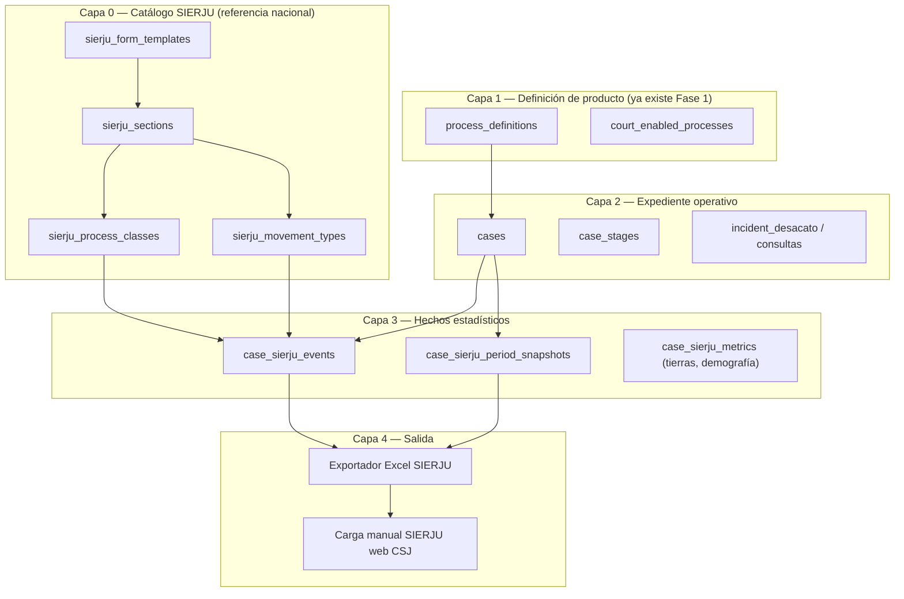
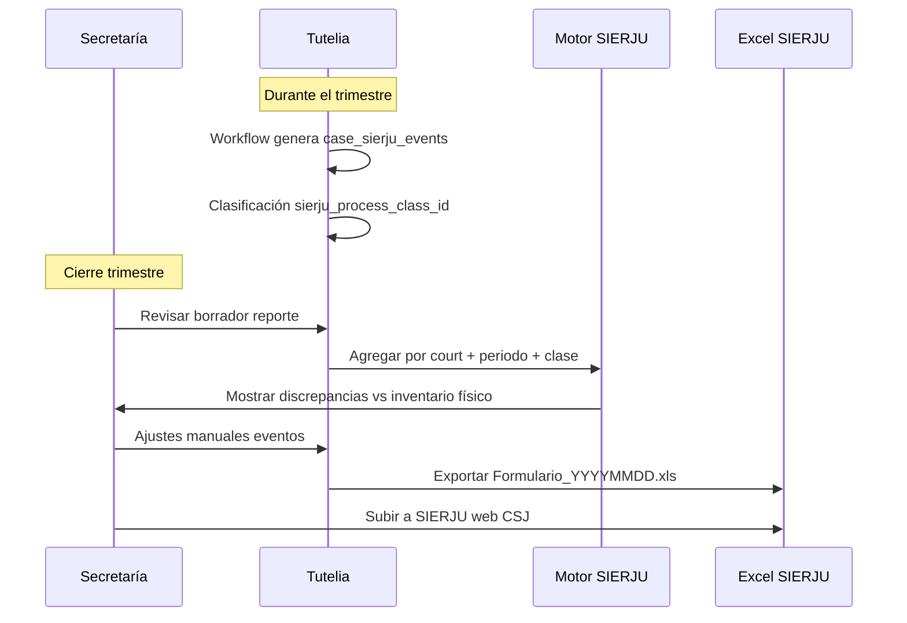

# SIERJU — Estadística judicial e integración con Tutelia

Documento de referencia para conectar la plataforma (`process_definitions`, expedientes, tutelas) con el **Sistema de Información Estadística de la Rama Judicial (SIERJU)**.

**Estado:** diseño documentado — sin migración SQL ni exportador implementados aún.  
**Despacho piloto de referencia:** Juzgado 051 Civil del Circuito de Bogotá (`110013103051`).  
**Arquitectura base:** `docs/architecture-plataforma-judicial.md` (Fase 1 en `20260529120000_judicial_process_platform_phase1.sql`).

---

## 1. Objetivo

Permitir que, a partir de los expedientes que Tutelia ya gestiona (o importa de SGDE/TYBA), se pueda:

1. **Clasificar** cada caso según la fila SIERJU correcta (clase de proceso, sección, derecho tutelado, etc.).
2. **Registrar eventos de movimiento** (entrada por reparto, salida por sentencia, reingreso por nulidad…) con las reglas del manual UDAE.
3. **Agregar por periodo trimestral** inventarios, entradas, salidas y métricas especiales (restitución de tierras, demografía de partes).
4. **Exportar** un Excel compatible con el formulario que corresponda al despacho.

Esto **no sustituye** el flujo procesal (`case_stages`, etapas, plazos). Es una **capa transversal de reporting** que lee hechos del expediente y los traduce a contadores SIERJU.

---

## 2. Fuentes normativas (insumos del proyecto)

| Fuente | Qué aporta | Ubicación |
|--------|-----------|-----------|
| Excel exportado SIERJU | Filas reales del formulario **Juzgado Civil Circuito 2023 V.4** con datos del 051 (ene–mar 2026) | `Formulario_20260529_114742.xls` (descarga local) |
| Manual UDAE 2019 | Definiciones de **cómo contar** (entradas, salidas, sin trámite, no duplicar) | `31.-Manual-Instructivo-Sala-Civil-Especializada-en-Restitución-de-Tierras.pdf` |
| Arquitectura Tutelia | `process_definitions`, `courts`, CUI, alcance MVP tutelas | `docs/architecture-plataforma-judicial.md` |
| Desacato | Incidente ≠ proceso independiente | `docs/incidente-desacato-modelo-expediente.md` |

### 2.1 Dos formularios distintos (no mezclar)

| Variante | Código interno propuesto | Despacho tipo | Clases de proceso |
|----------|-------------------------|---------------|-------------------|
| **Juzgado Civil Circuito 2023 V.4** | `sierju_civil_circuito_2023_v4` | J051 y juzgados civil circuito | ~251 filas: civil escrito/oral, laboral, familia, tutelas, 2ª instancia… |
| **Sala Restitución de Tierras 2019** | `sierju_restitucion_tierras_2019` | Salas especializadas Ley 1448 | 4 clases tierras + civil concurrente reducido + módulo solicitudes/opositores |

El piloto **051** usa el primero. El manual PDF aplica al segundo, pero sus **definiciones de movimiento** son reutilizables en ambos.

---

## 3. Conceptos SIERJU (obligatorios en código)

Extraídos del manual UDAE §1 y §2.

### 3.1 Proceso

Toda denuncia, demanda o acción constitucional que se tramita en el despacho. **Unidad de medida** en secciones civil/laboral/familia.

### 3.2 Periodo

Trimestre calendario (Acuerdo PSAA16-10476):

| Periodo | Desde | Hasta |
|---------|-------|-------|
| 1 | 01-ene | 31-mar |
| 2 | 01-abr | 30-jun |
| 3 | 01-jul | 30-sep |
| 4 | 01-oct | 31-dic |

Reporte: **5.º día hábil** del mes siguiente (salvo vacancia judicial en P4).

Si hubo más de un juez en el periodo → **un formulario por funcionario**, con fechas de posesión/retiro.

### 3.3 Proceso sin trámite

Contar como “sin trámite” si cumple **cualquiera** (§1.3):

1. Suspensión o interrupción de **6+ meses**.
2. **6+ meses** ante el superior por apelación en efecto suspensivo.
3. **6+ meses** sin actuación y no es posible impulso oficioso.

Inventario inicial/final se desagrega en **con trámite** vs **sin trámite**.

### 3.4 Ponente

Todas las actuaciones reportadas son las donde el funcionario actuó como **ponente**.

### 3.5 Reglas de conteo (críticas para el motor)

| Regla | Implicación en Tutelia |
|-------|------------------------|
| Un proceso → **una sola** entrada por periodo | Al radicar, emitir un solo `case_sierju_event` de entrada |
| Un proceso → **una sola** salida efectiva por periodo | Al terminar, un solo evento de salida de la lista cerrada |
| **Reparto** = solo procesos **nuevos** para la Rama | Import SGDE histórico ≠ reparto; usar columna correcta |
| No duplicar reparto + descongestión/reingreso/recibido | Validación en UI/servicio al registrar movimiento |
| Entradas/salidas **no efectivas** no suman ingreso/egreso efectivo | Flag `is_effective` en catálogo de movimientos |
| **Acumulados**: contar procesos acumulados al principal, no el principal | Evento `proceso_acumulado` con FK al caso principal |
| Tutela con varios derechos → reportar **solo el de mayor relevancia** | Campo `primary_fundamental_right` en metadata tutela |
| Desacato: derecho debe **coincidir** con el reportado en tutela | Validar al crear incidente |
| Devolución de 2ª instancia / tutela temporal **≠** nueva entrada | No emitir evento reparto al reingreso administrativo |

---

## 4. Panorama: tres capas de datos



### Qué NO va en `process_definitions`

| Concepto SIERJU | Modelo Tutelia |
|-----------------|----------------|
| Fila “DECLARATIVOS ORDINARIOS” | `sierju_process_classes` + FK/metadata en `cases` |
| Columna “SENTENCIAS” (salida) | `case_sierju_events.movement_code = salida_sentencias` |
| “DEBIDO PROCESO” (tutela) | Metadata `fundamental_right` |
| Incidente de desacato | Actuación en expediente madre (ver doc desacato) |
| Solicitud de restitución dentro de un proceso | Sub-entidad `case_land_restitution_requests` (futuro) |
| Liquidación de costas, remates | Sección “Trámite posterior — actuaciones”, no tipo de proceso |

---

## 5. Modelo de datos propuesto (Fase SIERJU — por implementar)

### 5.1 Catálogo

```sql
-- Plantilla de formulario por tipo de despacho
sierju_form_templates (
  code              text primary key,  -- 'sierju_civil_circuito_2023_v4'
  label             text,
  version           text,
  effective_from    date,
  source_document   text               -- ruta o referencia al manual/excel
)

-- Hoja / bloque del formulario
sierju_sections (
  id                uuid primary key,
  form_template_code text references sierju_form_templates,
  code              text,              -- 'civil_1a_escrito', 'movimiento_tutelas'
  label             text,
  specialty         text,              -- civil | laboral | familia | constitucional | tierras
  instance_level    smallint,          -- 1 | 2
  procedure_mode    text,              -- escrito | oral | null
  sort_order        int,
  unit_of_measure   text,              -- proceso | tutela | solicitud | actuacion | persona
  unique (form_template_code, code)
)

-- Filas del formulario (TIPOS PROCESOS / derechos / etc.)
sierju_process_classes (
  id                uuid primary key,
  section_id        uuid references sierju_sections,
  code              text,              -- slug estable: 'declarativos_ordinarios'
  label             text,              -- texto exacto SIERJU
  parent_class_id   uuid,              -- jerarquía opcional
  tyba_process_hint text,              -- mapeo TYBA/SGDE cuando se conozca
  metadata          jsonb default '{}',
  sort_order        int,
  unique (section_id, code)
)

-- Columnas de movimiento (entrada/salida/inventario)
sierju_movement_types (
  id                uuid primary key,
  section_id        uuid references sierju_sections,  -- null = compartido entre secciones
  code              text,              -- 'entrada_reparto', 'salida_sentencias'
  label             text,
  movement_kind     text check (movement_kind in (
                      'inventario_inicial', 'entrada', 'salida',
                      'inventario_final', 'metrica', 'reactivado', 'acumulado'
                    )),
  is_effective      boolean default true,  -- false = otras entradas/salidas no efectivas
  sort_order        int
)
```

Referencia machine-readable de movimientos compartidos: `docs/sierju/movimientos-comunes.json`.

### 5.2 Enlace al expediente

```sql
-- Clasificación SIERJU del caso (estable una vez definida)
alter table cases add column if not exists sierju_process_class_id uuid
  references sierju_process_classes (id);
alter table cases add column if not exists sierju_metadata jsonb default '{}'::jsonb;
-- sierju_metadata ejemplos:
--   fundamental_right: 'debido_proceso'
--   procedure_mode: 'oral'
--   quantia_band: 'sin_cuantia' | 'mayor_20_smlmv'  (laboral)

-- Hechos puntuales que alimentan columnas del trimestre
case_sierju_events (
  id                uuid primary key,
  case_id           text references cases (id),
  court_id          text references courts (id),
  movement_type_id  uuid references sierju_movement_types,
  process_class_id  uuid references sierju_process_classes,  -- redundante pero útil en consultas
  event_date        date not null,
  period_year       smallint,
  period_quarter    smallint check (period_quarter between 1 and 4),
  quantity          int default 1,       -- casi siempre 1 proceso; solicitudes tierras pueden ser N
  source            text,                -- 'manual' | 'workflow' | 'import_sgde' | 'inferred'
  source_ref        jsonb,               -- stage_code, document_id, etc.
  created_by        uuid,
  created_at        timestamptz default now()
)

-- Snapshot de inventario al corte (opcional; alternativa: calcular solo con eventos)
case_sierju_period_snapshots (
  court_id          text,
  period_year       smallint,
  period_quarter    smallint,
  process_class_id  uuid,
  inventory_with_tramite int,
  inventory_without_tramite int,
  pending_fallo     int,
  primary key (court_id, period_year, period_quarter, process_class_id)
)
```

### 5.3 Relación con `process_definitions` (producto)

| `process_definitions` | `sierju_process_classes` |
|----------------------|--------------------------|
| Pipeline de etapas, plazos, radicación | Fila del Excel estadístico |
| Pocas filas (~20 familias de trámite) | Muchas filas (~251 en civil circuito) |
| 1:1 o 1:N | N:1 desde casos hacia clase SIERJU |

Tabla puente propuesta:

```sql
process_definition_sierju_classes (
  process_definition_id uuid references process_definitions,
  sierju_process_class_id uuid references sierju_process_classes,
  is_default boolean default false,
  primary key (process_definition_id, sierju_process_class_id)
)
```

Ejemplo: `civil_ejecutivo_oral` (producto) → clases SIERJU `ejecutivos`, `ejecutivos_con_garantia_real`.

---

## 6. Formulario Civil Circuito 2023 V.4 (J051)

Extraído del Excel del despacho 051. **24 secciones**, **~251 filas** de clasificación.

### 6.1 Secciones

| Código sección | Label | Filas | Notas |
|----------------|-------|------:|-------|
| `civil_1a_escrito` | Primera y única instancia Civil-Escrito | 26 | Declarativos, ejecutivos, insolvencia, pertenencia, RC… |
| `civil_1a_oral` | Primera y única instancia Civil-Oral | 24 | Verbales, especiales, ejecutivos, consumidor… |
| `laboral_1a_escrito` | Primera y única Instancia Laboral | 6 | Ordinarios, ejecutivos, fuero sindical, acoso L.1010 |
| `laboral_1a_oral` | Primera y única Instancia Laboral - Oral | 17 | Ordinarios por materia × instancia, ejecutivos laborales |
| `familia_1a_escrito` | Primera y única Instancia Familia - Escrito | 21 | Alimentos, custodia, divorcio, sucesión… |
| `familia_1a_oral` | Primera y única Instancia Familia - Oral | 23 | + medidas VIF infancia, partición en vida |
| `acciones_const_1a` | Primera instancia Acciones constitucionales | 4 | Cumplimiento, grupo, popular, hábeas corpus |
| `movimiento_tutelas` | Movimiento de Tutelas | 12 | Por **derecho fundamental** |
| `procesos_post_decision` | Procesos iniciados después de decisión | 3 | Ejecutivos, declarativos, otros |
| `civil_2a_escrito` | Segunda Instancia Civil - Escrito | 21 | Recursos |
| `civil_2a_oral` | Segunda Instancia Civil - Oral | 16 | Recursos |
| `incidentes_desacato` | Incidentes de Desacato | 12 | Por derecho (incidente en caso madre) |
| `impugnaciones` | Movimiento de Impugnaciones | 12 | Por derecho |
| `acciones_const_2a` | Segunda Instancia Acciones Constitucionales | 1+ | |
| `consultas_desacato` | Consultas Incidentes de Desacato | 12 | Por derecho |
| `tramite_posterior_actuaciones` | Trámite posterior - Actuaciones | 7 | Costas, remates, incidentes, cautelares… |
| `tramite_posterior_procesos` | Trámite posterior - Procesos | 3 | Civiles, familia, laboral |
| `audiencias` | Audiencias | 3 | Por especialidad |
| `otros_asuntos` | Otros asuntos | 7 | Comisorios, pruebas anticipadas… |
| `total_providencias` | Total providencias dictadas | — | Agregado |
| `recursos_interpuestos` | Recursos interpuestos | 7 | Apelación, reposición, queja… |
| `recursos_decididos_superiores` | Recursos decididos por superiores | 7 | Confirma, revoca, modifica… |
| `actuaciones_especiales` | Actuaciones especiales | 3 | Remates, amparo pobreza… |
| `archivados` | Procesos archivados definitivamente | 1 | |

Listado completo de filas civil escrito/oral: ver `docs/sierju/clases-civil-circuito-2023.md` (generado desde Excel).

### 6.2 Clases civil 1ª instancia escrito (26)

DECLARATIVOS - ORDINARIOS · ABREVIADOS · VERBALES · VERBAL SUMARIO · DIVISORIOS · OTROS · EJECUTIVOS · EJECUTIVOS - HIPOTECARIO · INSOLVENCIA DE PERSONA NATURAL · INSOLVENCIA DE SOCIEDADES · PROCESOS DE LIQUIDACIÓN (3 variantes) · PROCESOS DE JURISDICCIÓN VOLUNTARIA · PROCESOS DE PERTENENCIA · SERVIDUMBRES · TITULACIÓN DE PREDIOS · LIQUIDACIÓN SOCIEDADES PATRIMONIALES DE HECHO · EXPROPIACIÓN · DESLINDE Y AMOJONAMIENTO · IMPUGNACIÓN ACTAS ASAMBLEAS · COMPETENCIA DESLEAL · RESPONSABILIDAD CIVIL EXTRACONTRACTUAL · CONTRACTUAL · CONCILIACIÓN EXTRAJUDICIAL · OTROS PROCESOS

### 6.3 Derechos fundamentales (tutela / desacato / impugnación / consulta)

Misma lista en las 4 hojas:

SALUD · SEGURIDAD SOCIAL · VIDA · MÍNIMO VITAL · IGUALDAD · EDUCACIÓN · DEBIDO PROCESO · DERECHO DE PETICIÓN · DERECHO A LA INFORMACIÓN PÚBLICA · CONTRA PROVIDENCIAS JUDICIALES · MEDIO AMBIENTE · OTROS

Código enum propuesto en app: `FundamentalRightCode` en `src/lib/sierju-types.ts` (futuro).

### 6.4 Columnas demográficas (procesos terminados)

Presentes en civil/laboral/familia: sexo, grupo étnico, edad, discapacidad de demandante y demandado. **No son movimientos**; son métricas al momento de la salida efectiva → tabla `case_sierju_party_metrics` (futuro) o campos en evento de terminación.

---

## 7. Formulario Restitución de Tierras 2019

Manual: `31.-Manual-Instructivo-Sala-Civil-Especializada-en-Restitución-de-Tierras.pdf`.

### 7.1 Secciones adicionales (no están en civil circuito)

| Sección | Contenido |
|---------|-----------|
| `civil_1a_tierras` | 4 clases Ley 1448 / decretos étnicos |
| `civil_2a_tierras_consulta` | Consultas en 2ª instancia tierras |
| `solicitantes_beneficiarios_opositores` | Demografía procesal tierras |
| `opositores_segundos_ocupantes` | Segundos ocupantes |
| `postfallo` | Trámite post-sentencia tierras |
| `seguimiento_ordenes_sentencia` | Impulsos a órdenes |
| `medidas_cautelares` | Inventario/decretadas tierras |

### 7.2 Clases civil tierras (§3.1 manual)

1. `restitucion_comunidades_negras_4635`
2. `restitucion_comunidades_indigenas_4633`
3. `restitucion_formalizacion_ley1448_cap3`
4. `restitucion_pueblo_rom_4634`

### 7.3 Métricas exclusivas tierras (al salir por sentencia)

| Métrica | Campos |
|---------|--------|
| Restitución | m² restituidos, predios restituidos |
| Compensación | predios inmueble, m² inmueble, compensación en dinero |
| Formalización | m² formalizados, bienes formalizados |

### 7.4 Solicitudes dentro del proceso (§3.11)

Un **proceso** de tierras contiene **N solicitudes** (restitución/compensación). Estadística separada:

- Inventario solicitudes inicio/fin periodo
- Ingreso solicitudes en periodo
- Salida: incorporadas en sentencia / negadas / otros conceptos

Modelo futuro:

```sql
case_land_restitution_requests (
  id uuid primary key,
  case_id text references cases,
  request_kind text,  -- restitucion | compensacion | otra
  status text,
  ...
)
```

---

## 8. Cómo conectar con lo que ya existe en Tutelia

### 8.1 Mapa campo a campo

| Dato Tutelia | Uso SIERJU |
|--------------|------------|
| `courts.dane_code`, `entity_code`, `specialty_code`, `despacho_number` | Identificar despacho en formulario; derivar `form_template_code` |
| `cases.process_definition_id` | Familia de trámite → sugerir clases SIERJU vía puente |
| `cases.case_type` | Tutelas: `tutela_primera` → sección `movimiento_tutelas` |
| `cases.radicado_at` | Fecha para `entrada_reparto` en periodo |
| `case_stages.stage_code` terminal | Inferir salida (FALLO → sentencia; INADMISION → rechazo…) |
| Metadata tutela (derecho tutelado) | Fila en hoja tutelas/desacato |
| Incidente desacato | Hoja 12; **no** nuevo `case` raíz |
| `consulta_desacato` | Hoja 15 |

### 8.2 Eventos inferibles automáticamente (Fase exportador v1)

| Evento workflow | Movimiento SIERJU sugerido |
|-----------------|---------------------------|
| Radicación nueva (`cases` insert) | `entrada_reparto` |
| Import SGDE histórico | `entrada_recibido_otros_despachos` o sin evento entrada (solo inventario inicial) |
| Etapa `INADMISION` / rechazo demanda | `salida_rechazados_retirados` |
| Etapa `FALLO` tutela concede | `salida_concede` |
| Etapa `FALLO` tutela niega | `salida_niega` |
| Sentencia civil terminal | `salida_sentencias` |
| Remisión competencia | `salida_remitidos` o `salida_otras_no_efectivas` según contexto |

Siempre permitir **corrección manual** antes de cerrar el trimestre (la secretaria es responsable del dato ante la CSJ).

### 8.3 Alcance MVP actual

`src/lib/process-product-scope.ts` limita radicación a tutelas. **SIERJU puede prepararse en paralelo**:

- Seed catálogo completo civil circuito (referencia).
- Registrar eventos solo para tutelas + desacato + impugnaciones (hojas 8, 12, 13, 15).
- Ampliar a civil cuando se habilite `civil_ejecutivo_oral` en producto.

---

## 9. Flujo operativo trimestral (target)



### Validaciones pre-export

- [ ] Cada caso abierto sin sentencia aparece en inventario final (con/sin trámite).
- [ ] Suma entradas efectivas − salidas efectivas + inventario inicial ≈ inventario final (por clase).
- [ ] Ningún caso con dos entradas efectivas en el mismo periodo.
- [ ] Tutelas: mismo derecho en entrada y salida.
- [ ] Desacato: derecho alineado con tutela madre.

---

## 10. Integración SGDE / TYBA

| Origen | Campo origen | Destino SIERJU |
|--------|--------------|----------------|
| SGDE tipo proceso | Clasificación TYBA | `sierju_process_classes.tyba_process_hint` → FK caso |
| SGDE radicado | Fecha | Periodo + evento entrada |
| SGDE estado / última actuación | Inferencia | Movimiento salida o inventario |
| CUI 23 dígitos | `courts` | Cabecera formulario |

Script existente relacionado: import SGDE (`server/sgde-import.ts`, `ImportFromSgde.tsx`). **Extensión futura:** al importar, proponer `sierju_process_class_id` desde tabla de mapeo.

Archivo de mapeo propuesto (mantener en repo cuando se valide con secretaria):

`docs/sierju/mapeo-tyba-sgde-clases.md`

---

## 11. Plan de implementación por fases

### Fase S0 — Documentación y seeds de referencia ✅ (este documento)

- [x] Documentar modelo, reglas, secciones J051.
- [x] JSON movimientos comunes (`docs/sierju/movimientos-comunes.json`).
- [ ] Extraer CSV/JSON todas las filas del Excel 051 → script `scripts/sierju/extract-form-classes.mts` (opcional).

### Fase S1 — Catálogo en BD (1 migración) ✅

Migración: `supabase/migrations/20260530140000_sierju_catalog_phase_s1.sql`  
Seed regenerable: `npx tsx scripts/sierju/generate-sierju-seed-sql.mts` → `supabase/seed/sierju_catalog_seed.sql`  
Verificación: `scripts/sql/verify-migrations-20260530-sierju-s1.sql`  
Tipos TS: `src/lib/sierju-types.ts`

- [x] Tablas §5.1 (`sierju_form_templates`, `sierju_sections`, `sierju_process_classes`, `sierju_movement_types`, puentes).
- [x] Columnas `courts.sierju_form_template_code`, `cases.sierju_process_class_id`, `cases.sierju_metadata`.
- [x] Seed 2 formularios, 26 secciones, 255 clases, 61 movimientos.
- [x] Despacho piloto `court-1` → `sierju_civil_circuito_2023_v4`.
- [x] Puente `process_definition_sierju_classes` tutela/consulta ↔ filas derechos fundamentales.
- [x] RLS: lectura `authenticated`; escritura `service_role`.

### Fase S2 — Clasificación en casos ✅

- [x] Columnas `cases.sierju_process_class_id` + `sierju_metadata` (S1).
- [x] `src/lib/sierju-catalog-service.ts` — clases por `process_definition` y despacho.
- [x] `src/lib/sierju-code-bridge.ts` — puente `derecho_tutelado_code` ↔ fila SIERJU.
- [x] `src/components/expediente/CaseSierjuClassification.tsx` — selector reutilizable.
- [x] Radicación (`NewCase`) y detalle (`CaseDetail`) persisten clase + metadata.
- [ ] Importación SGDE: backfill SIERJU post-import (servidor).
- [ ] Mapeo TYBA/SGDE → clase (`sierju_tyba_class_map`) con secretaría.

### Fase S3 — Eventos y borrador trimestral

1. Tabla `case_sierju_events`.
2. Hooks al avanzar etapa / radicar / terminar caso.
3. Pantalla `EstadisticaSierjuPanel`: borrador por trimestre, editable.
4. Job cálculo inventario final y “procesos para fallo”.

### Fase S4 — Exportador Excel

1. Plantilla `.xls` base por formulario (copiar estructura CSJ).
2. Servicio Node que rellena celdas desde agregados.
3. Validaciones §9 pre-descarga.

### Fase S5 — Restitución de tierras (despachos especializados)

1. Segundo template `sierju_restitucion_tierras_2019`.
2. Sub-entidad solicitudes + métricas m²/predios.
3. Secciones solicitantes/opositores/postfallo.

---

## 12. Archivos a crear (checklist desarrollo)

```
docs/sierju-estadistica-integracion.md          ← este archivo
docs/sierju/movimientos-comunes.json
docs/sierju/clases-civil-circuito-2023.md
docs/sierju/mapeo-tyba-sgde-clases.md          ← completar con secretaria

supabase/migrations/20260530140000_sierju_catalog_phase_s1.sql
supabase/seed/sierju_catalog_seed.sql
scripts/sierju/generate-sierju-seed-sql.mts
scripts/sql/verify-migrations-20260530-sierju-s1.sql

src/lib/sierju-types.ts
src/lib/sierju-catalog-service.ts
src/lib/sierju-code-bridge.ts
src/components/expediente/CaseSierjuClassification.tsx
src/lib/sierju-events-service.ts
src/lib/sierju-period-utils.ts                 ← periodo trimestral, corte fechas
src/lib/sierju-export/                         ← Fase S4
src/components/expediente/CaseSierjuClassification.tsx
src/pages/SierjuQuarterlyReport.tsx

server/sierju-export-routes.ts                 ← Fase S4
scripts/sierju/extract-form-classes.mts      ← desde Excel oficial
```

---

## 13. Decisiones de diseño cerradas

1. **SIERJU es capa aparte** del pipeline `process_stages_definition`; no mezclar etapas procesales con columnas estadísticas.
2. **Un formulario por variante de despacho**, seleccionado por template code (no hardcodear filas en TS).
3. **Incidente desacato y consulta** generan eventos SIERJU pero **no** `process_definitions` ni casos hijo independientes (coherente con arquitectura actual).
4. **251 clases ≠ 251 pipelines**; producto usa ~20 `process_definitions`; SIERJU usa clases finas para reporting.
5. **Responsabilidad del dato** es del funcionario; Tutelia **asiste** con borrador exportable, no reemplaza SIERJU web sin revisión humana.

---

## 14. Referencias cruzadas

| Tema | Documento |
|------|-----------|
| Arquitectura process_definitions | `docs/architecture-plataforma-judicial.md` |
| Desacato | `docs/incidente-desacato-modelo-expediente.md` |
| CUI / radicación | `docs/architecture-plataforma-judicial.md` §4 |
| MVP solo tutelas | `src/lib/process-product-scope.ts` |
| Migración Fase 1 | `supabase/migrations/20260529120000_judicial_process_platform_phase1.sql` |

---

*Última actualización: 2026-05-29 — elaborado a partir del Excel SIERJU J051 (2023 V.4) y Manual UDAE Restitución de Tierras 2019.*
